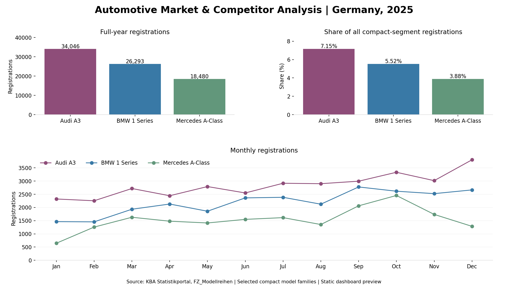

# Automotive Market & Competitor Analysis

An analysis of German passenger-car registrations in 2025, comparing **Audi A3, BMW 1 Series and Mercedes A-Class** in the compact segment.

**Tools:** SQL (SQLite), Tableau Public, and Python for importing the cleaned CSV and running SQL queries.

**Status:** Completed SQL analysis and Tableau dashboard. A static preview is shown below; the [interactive dashboard is available on Tableau Public](https://public.tableau.com/app/profile/arwa.menaouar/viz/AutomotiveMarketAnalysisProject_AM/AutomotiveMarketOverview-2025).



## Business question

How did the three model families compare in annual registrations, monthly trends and compact-segment share?

## Main findings

| Model | 2025 registrations | Share of the full compact segment |
|---|---:|---:|
| Audi A3 | 34,046 | 7.15% |
| BMW 1 Series | 26,293 | 5.52% |
| Mercedes A-Class | 18,480 | 3.88% |

Audi A3 led this selected peer group. All three models recorded higher registrations in July-December than January-June. BMW had the largest percentage increase between those periods, at 34.72%.

These are **registrations, not sales**. The data does not explain why volumes changed or measure revenue, profit or customer demand.

## Data and preparation

Source: **Kraftfahrt-Bundesamt (KBA), Statistikportal, FZ_Modellreihen**.

[Official portal](https://das-kba-statistikportal.hub.arcgis.com/)

The downloaded export was `SP_Modellreihen_1731554449119816558.xlsx`. Filtering to 2025 retained **4,917 records** across all 12 months. A separate **36-record** table contains the selected models.

Registration counts were preserved. Checks found no missing registration counts or duplicate year/month/segment/brand/model keys in 2025. The refined dataset keeps nine relevant fields; added month-start dates support chronological sorting. Processing counts are recorded in [the cleaning log](docs/cleaning_log.json).

Full segment share uses **476,480 compact-segment registrations** as its denominator. It differs from share within the three-model peer group. Results reflect the downloaded snapshot.

## SQL analysis

[Read the six SQL queries](sql/analysis.sql). They cover annual totals, monthly trends, segment shares, half-year comparisons, peak months and monthly segment shares.

The queries use filtering, aggregation, `CASE`, CTEs and joins. Each query has a short explanation.

## Reproduce the results

With Python 3 installed, run from this folder:

```bash
python run_analysis.py
```

No additional Python packages are required. The script imports the cleaned CSV into SQLite, runs the SQL and writes six result CSVs. It rebuilds its local project database and result files.

Alternatively, open the generated `automotive_2025.sqlite` in DB Browser for SQLite to inspect the data and run queries.

## Files

- `data/`: cleaned 2025 records and the selected model records.
- `sql/`: analysis queries.
- `results/`: six SQL result tables, ready for Tableau.
- `reports/`: [findings and recommendations](reports/Automotive_Market_Competitor_Analysis.pdf).
- `images/`: static preview of the Tableau dashboard.
- `docs/`: data preparation log documenting row counts, year filtering, and data quality checks.


